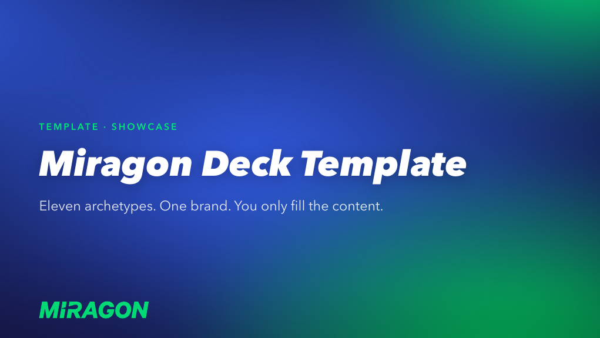

# Miragon Slidev Deck Template

A reusable Slidev template in the Miragon corporate design. Fill in your content — the design, animations and colours are done.



> **Authoring guide:** the `slides` skill (`.claude/skills/slides/`). The README onboards you; the skill answers everything else, and the code in `packages/toolkit/` is the rendering truth.

## Pick your path

- **I want to build a deck right now** → [Your first 5 minutes](#your-first-5-minutes)
- **I want Claude to draft slides for me** → [Working with Claude](#working-with-claude)
- **I want to understand or change the design** → the `slides` skill and `packages/toolkit/`

## Prerequisites

- **Node.js 20.x or newer** (check with `node --version`; install via [nodejs.org](https://nodejs.org) or `nvm install 20`)
- A modern browser (Chrome, Safari, Firefox, Edge — WebGL2 is used for the animated background; a CSS gradient fallback covers browsers without it)
- Optional: [Claude Code](https://claude.com/claude-code) — the repo ships with `CLAUDE.md` and the `slides` skill that Claude reads on the first prompt

## Quick start

```bash
npm install      # once, ~30s — pulls Slidev and a Chromium for PDF export
npm run dev      # opens the deck on http://localhost:3030 with live reload
```

Edit the files under `deck/` and save — the preview updates instantly. Stop the dev server with `Ctrl-C`.

## How the deck is organised

The design system is the **`@miragon/slidev-toolkit`** package in **`packages/toolkit/`**, an npm-workspace package that the deck consumes by name; you don't touch it. Your content lives under **`deck/`**:

- **`deck/slides.md`** — the entry. Holds the deck headmatter, the `cover` slide, a `src:` import per chapter, and the `closing` slide.
- **`deck/chapter/NN-name/`** — one folder per chapter, holding `NN-name.md` (the slides; each begins with a `section` divider) and a **`resources/`** subfolder with that chapter's own assets (images, photos, `.bpmn`, `.svg`).

Chapter resources are served at `/resources/<chapter>/<file>` by a small Vite plugin in `deck/vite.config.ts`, so frontmatter just points at that path (e.g. `photo: /resources/01-foundations/me.png`). To add a chapter, create `deck/chapter/NN-<name>/NN-<name>.md` (plus a `resources/` folder) and add a `src: ./chapter/NN-<name>/NN-<name>.md` line in `deck/slides.md`.

## Your first 5 minutes

1. **Open the deck.** Run `npm run dev`. Your browser opens at `http://localhost:3030` showing the cover slide.
2. **Navigate.** Use the keyboard:

   | Key | What it does |
   |---|---|
   | `→` / `Space` | Next click or slide |
   | `←` | Previous |
   | `o` | Slide overview grid |
   | `p` | Presenter mode (notes + next-slide preview) |
   | `f` | Fullscreen |
   | `d` | Toggle dark mode |
   | `Esc` | Close overview / dialog |

3. **Open `deck/slides.md`** and the chapter files under `deck/chapter/`. Each slide is a frontmatter block (`--- … ---`) followed by Markdown. Every demo slide carries a comment block with `REQUIRED` / `OPTIONAL` / `LIMIT` / `HOW TO USE` — that is your in-place authoring guide.
4. **Change the cover title.** In `deck/slides.md`, replace `# Miragon Deck Template` with your own. Save. The browser updates instantly.
5. **Pick the right archetype for your next slide.** Single bold statement? `hero`. A diagnosis with bullets? `content`. A before/after? `compare`. Full list below. When in doubt, open the closest demo under `deck/chapter/` and copy its structure.

That is the loop: pick an archetype, copy the demo, replace the content, keep the comment block as guardrails.

## The 11 archetypes

| Layout | What it's for | Limit |
|---|---|---|
| `cover` | Animated title slide | 1 statement |
| `hero` | One big statement, ideally a question the next slides answer | 1 idea, no bullets |
| `person` (solo / duo) | Introduce one or two speakers | bio ≤ 3 lines |
| `section` | Chapter divider with ghost index | terse subtitle |
| `content` | Workhorse: bullets, prose, or a card grid | ≤ 5 bullets, 1 nesting level |
| `content-image` | Two columns: image on one side, prose/bullets on the other | ≤ 4 bullets, 1 visual |
| `compare` | Side-by-side white panels; title colour carries the semantic distinction | ≤ 4 bullets per panel |
| `goodbad` | "Which one is right, and why?" — neutral panels + one-click reveal | keep panels short |
| `bpmn` | A BPMN file rendered with token simulation (requires `slidev-addon-bpmn`) | 1 diagram, short caption |
| `showcase` | Interactive feature explorer: clickable cards + cross-faded detail panel | 3–4 items |
| `closing` | Animated closing slide | 1 CTA |

## Components — keep the markdown clean

A slide should be frontmatter + headings + bullets + component tags, never raw `<div>`/CSS/hex. Reach for these (full props in the `slides` skill, `reference/components.md`):

| Component | What it's for |
|---|---|
| `Card` | The canonical white card; accent on the title only |
| `CardGrid` | The column wrapper for a row of `Card`s (replaces `<div class="grid …">`) |
| `StepList` / `Step` | A compact labelled sequence beside a diagram |
| `Figure` | A titled, captioned wrapper around a visual |
| `SplitView` | Two columns: a visual and an explanation |
| `Figure src="…​.excalidraw.svg"` | Embed a hand-drawn Excalidraw diagram (see the `excalidraw` skill) |

Every demo slide under `deck/` carries a `REQUIRED / OPTIONAL / LIMIT / HOW TO USE` comment block — keep those as guardrails when you write your own.

## What lives where

| Path | Purpose | Edit? |
|---|---|---|
| `deck/slides.md` | **Your deck's entry** (cover + chapter imports + closing) | ✅ yes |
| `deck/chapter/NN-name/NN-name.md` | One folder per chapter; the slides | ✅ yes |
| `deck/chapter/NN-name/resources/` | That chapter's assets (images, photos, `.bpmn`, `.svg`) | ✅ yes |
| `deck/vite.config.ts` | Serves each chapter's `resources/` at `/resources/<chapter>/` | ⚠️ rarely |
| `packages/toolkit/layouts/` | Slide archetypes (one `.vue` per archetype) | ⚠️ only with care |
| `packages/toolkit/components/` | Reusable components + `BrandMeshBackground` (WebGL Mesh shader) | ❌ no (brand asset) |
| `packages/toolkit/styles/theme.css` | Brand tokens | ❌ no (brand asset) |
| `packages/toolkit/styles/index.css` | Globally loaded stylesheet | ⚠️ rarely |
| `packages/toolkit/assets/` | Brand assets (logo, komet) bundled with the theme | ❌ no |
| `CLAUDE.md` | Rules Claude reads on every session in this repo | ❌ no |
| `.claude/skills/slides/` | The authoring guide (skill + reference) | ❌ no (read it) |

## Presenting and exporting

**Present live (full Mesh animation):** `npm run dev`. Presenter mode (`p`) gives you speaker notes and a next-slide preview on your laptop while the audience sees only the current slide.

**Ship a static deck:** `npm run build` produces a `dist/` folder you can host anywhere (S3, Netlify, Vercel, even `python -m http.server dist/`). The Mesh animation works in the built deck too; no Node needed at runtime.

**Export a PDF:** run `npm run export` to produce `slidev-exported.pdf` locally. PDF export is **not** part of `npm run build` on purpose: it needs a Playwright/Chromium browser, which is not available on hosted CI builders (e.g. Netlify) and would fail the build there. If you want the in-deck **download button** back, re-add `download: true` to the [`deck/slides.md`](deck/slides.md) headmatter and make sure your build environment runs `npx playwright install chromium-headless-shell` before `npm run build`.

**Verify the layout:** `npm run verify` walks every slide and checks the design-system rules (fits the canvas, white cards, black headings, no em-dashes, no emoji, …) with a per-slide screenshot report.

**Auto-deploy to GitHub Pages:** the repo's [`.github/workflows/build-and-deploy.yml`](.github/workflows/build-and-deploy.yml) builds and deploys on every push to `main`. A repo created via *Use this template* gets a live URL at `https://<org>.github.io/<repo>/` out of the box — enable Pages → Source: GitHub Actions in your repo settings.

## Working with Claude

This template ships with `CLAUDE.md` and the `slides` skill, so a Claude Code session in this repo knows the design system on the first prompt. Open the repo with Claude Code and start writing.

### Starter prompts

Build the spine of a new deck:

> I am preparing a 30-minute talk on [your topic]. Outline the deck using these archetypes: `cover`, `hero`, three `section` chapters with two `content` slides each, then `closing`. Split it into chapter files under `deck/chapter/` and keep the demo comment-block format on every slide.

Add a content slide with a card grid:

> Add a `content` slide titled "Three habits of a clean release". Use a `CardGrid` of 3 white cards: title accent blue → teal → green.

Compare two states:

> Build a `compare` slide titled "Manual vs. Automated" with three bullets per side. Lead paragraph: "Same job, two operating modes."

Set up an interactive teaching slide:

> Build a `goodbad` slide that asks "Which error message helps the user more?" Make Model A the avoid side. Legend: "Tell the user what to do next, not what broke."

Restyle a draft:

> I drafted this paragraph in plain Markdown: [paste]. Turn it into a `content` slide with `<v-clicks>` progressive reveal.

### Tips

- For multi-slide work, give Claude the outline first, then iterate slide by slide.
- Claude respects the white-card rule, the no-em-dash rule, the heading-colour rules, and the "vary `leftIsGood`" rule automatically — they load from the `slides` skill every session.
- Speaker notes default to English. Add *"speaker notes in German"* to the prompt if you need them in another language.

## Troubleshooting

**`npm install` fails with errors about node-gyp / Python / build tools.** Check `node --version` — Slidev needs Node 20 or newer. On macOS without Xcode Command Line Tools, run `xcode-select --install`.

**Build crashes with `please install it via npm i -D playwright-chromium`.** The browser binary for the PDF export is missing. Run `npx playwright install chromium` once.

**`npm run export` produces an almost-empty PDF.** If Vite re-optimizes dependencies mid-export, the capture breaks. `vite.config.ts` pre-bundles the shader to avoid this. Run `npm run build` once first (to warm the pre-bundle), then `npm run export`.

**The cover/closing slides render white when WebGL is unavailable.** The theme has a `linear-gradient` fallback on `.cover-layout` / `.closing-layout`. If you still see white, your browser is blocking the gradient too — update or switch browsers.

**There is no PDF download button in the built deck.** That is by design: PDF export is disabled so the build stays green on hosted CI (see *Presenting and exporting*). Export locally with `npm run export`, or re-enable `download: true` in [`deck/slides.md`](deck/slides.md) if your build environment installs a Chromium browser first.

**Port 3030 is already in use.** Run `npm run dev -- --port 3031` (or any free port).

**Brand colours look wrong (everything black, no gradients).** The brand tokens live in `packages/toolkit/styles/theme.css` and are loaded by `packages/toolkit/styles/index.css`. If you moved or renamed either, restore them — the `:root` rule must load unscoped, which is exactly what `packages/toolkit/styles/index.css` does.

## FAQ

**Do I need Claude Code to use this?** No. The template is fully usable without it. Claude is a force multiplier, not a requirement.

**Can I share my deck without GitHub Pages?** Yes. `npm run build` outputs everything to `dist/`. Copy that folder to any static host. `dist/index.html` is the entry point.

**Can I change the brand colours?** The design is fixed by brand. If you really need to deviate, edit `packages/toolkit/styles/theme.css` and document the change.

**Can I add a new archetype layout?** Yes. Create a new `packages/toolkit/layouts/<name>.vue`, document it in the `slides` skill (`reference/archetypes.md`), and add a demo slide to a chapter with the comment block.

**Where do speaker photos go?** In the chapter's own `resources/` folder (e.g. `deck/chapter/01-foundations/resources/`). Reference them as `/resources/01-foundations/<file>` in the `person` frontmatter.

**How do I add a BPMN diagram?** Use the `bpmn` archetype. Put your `.bpmn` file in the chapter's `resources/` folder and set `diagram: /resources/<chapter>/<file>` in the frontmatter. Requires `slidev-addon-bpmn`, already in `package.json` and registered in `deck/slides.md`.

## Customising the design

The design system is **fixed by brand** and lives in `packages/toolkit/`. If you really need to deviate, change the token in `packages/toolkit/styles/theme.css` and note the change. The `slides` skill documents the sacred invariants you must not touch without brand sign-off.

## Creating a new deck from this template

1. Click **Use this template** on GitHub to spawn a new repository.
2. Clone your new repo and run `npm install`.
3. Replace the demo content under `deck/`; keep the comment-block guardrails.
4. `npm run dev` to preview, `npm run build` to ship a static deck.
5. Or: open the new repo with Claude Code and let it build the first draft from your topic outline using the [starter prompts](#starter-prompts) above.
