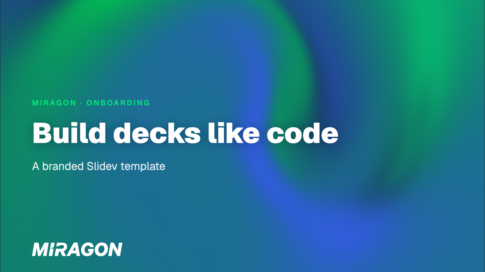

# Miragon Slidev Deck Template

[](LICENSE)
[](https://github.com/Miragon/slidev-deck-template/actions/workflows/ci.yml)
[](https://www.npmjs.com/package/@miragon/slidev-toolkit)

A reusable [Slidev](https://sli.dev) template in the Miragon corporate design. Fill in your content — the design, animations and colours are done.



## Quick start

Scaffold a fresh deck with one command. Needs **Node 20+** and a modern browser (WebGL2 for the animated background, with a CSS-gradient fallback).

```bash
npm create @miragon/slidev-deck@latest my-talk
# equivalently:
npx @miragon/create-slidev-deck@latest my-talk
```

```bash
cd my-talk
npm install
npm run dev      # serves the deck at https://my-talk.localhost with live reload
```

`npm run dev` runs through [portless](https://portless.sh): a stable, worktree-aware `https://<deck>.localhost` URL instead of a `:3030` port, so several decks run side by side without colliding. The first run starts a local HTTPS proxy (a one-time `sudo` prompt); `npx portless service install` makes it permanent — needed for a headless Conductor Run button, which can't answer the prompt. For the raw server without portless, use `npm run dev:app`.

You get a lean repo with **only** the files a deck needs (`deck/`, `.claude/`, `CLAUDE.md`, `slidev-validator.config.mjs`, the Build Deck + Pin Check workflows) and both `@miragon/slidev-toolkit` (the theme) and `@miragon/slidev-validator` (the guardrail linter) pulled from npm — no toolkit source, no copied validator, no release tooling to prune. Then:

1. Replace the demo content under `deck/`; keep the `REQUIRED / OPTIONAL / LIMIT / HOW TO USE` comment-block guardrails on each demo slide.
2. Point the `seoMeta` block in `deck/slides.md` at your own domain, or delete it — it still carries this template's link preview.
3. Commit the generated `package-lock.json` after the first `npm install` so CI (`npm ci`) is reproducible.
4. Or open the repo with Claude Code and let it draft the first pass from your outline.

## The 15 archetypes

Set `layout:` per slide. When in doubt, copy the closest demo under `deck/chapter/`.

| Layout | What it's for | Limit |
|---|---|---|
| `cover` | Animated title slide | 1 statement |
| `hero` | One big statement, ideally a question the next slides answer | 1 idea, no bullets |
| `person` | Introduce one or two speakers (solo / duo) | bio ≤ 3 lines |
| `section` | Chapter divider with ghost index; opens a chapter in the Agenda | terse subtitle |
| `subsection` | Divides a chapter internally; skipped by the Agenda rail | terse subtitle |
| `content` | Workhorse: bullets, prose, or a card grid | ≤ 5 bullets, 1 level |
| `content-image` | Two columns: image on one side, prose/bullets on the other | ≤ 4 bullets, 1 visual |
| `compare` | Side-by-side white panels; title colour carries the distinction | ≤ 4 bullets per panel |
| `goodbad` | "Which one is right, and why?" — neutral panels + one-click reveal | keep panels short |
| `bpmn` | A BPMN file with token simulation (needs `slidev-addon-bpmn`) | 1 diagram, short caption |
| `dmn` | A DMN decision table (needs `slidev-addon-dmn`) | 1 table |
| `mermaid` | A Mermaid fence framed as the slide's focal point | 1 diagram, short caption |
| `excalidraw` | An `.excalidraw.svg` framed as the slide's focal point | 1 diagram, short caption |
| `showcase` | Interactive feature explorer: clickable cards + detail panel | 3–4 items |
| `closing` | Animated closing slide | 1 CTA |

The built-in `default` layout is the one sanctioned non-archetype, for a full-bleed component slide such as the `Agenda`.

## Components — keep the markdown clean

A slide is frontmatter + headings + bullets + component tags, never raw `<div>`/CSS/hex. Full props in the `slides` skill (`.claude/skills/slides/reference/components.md`).

| Component | What it's for |
|---|---|
| `Card` | The canonical white card; accent on the title only |
| `CardGrid` | Column wrapper for a row of `Card`s |
| `StepList` / `Step` | A compact labelled sequence beside a diagram |
| `Figure` | A titled, captioned wrapper around a visual (incl. `.excalidraw.svg`) |
| `DiagramFrame` | The diagram layouts' white card, exposed to frame part of a slide |
| `SplitView` | Two columns: a visual and an explanation |
| `CodeBlock` | A code fence with a filename and a language badge |
| `Agenda` | The chapter stepper with live slide previews (`layout: default`) |
| `BrandMeshBackground` | The animated cover/closing shader (brand-locked) |

Tables need no component: a plain Markdown table is styled on-brand automatically.

## Present, build, export

Run these in your deck:

| Command | Result |
|---|---|
| `npm run dev` | Live preview at `https://<deck>.localhost` (portless); press `p` for presenter mode, `o` for overview |
| `npm run build` | Static `dist/` you can host anywhere (Mesh animation included, no Node at runtime) |
| `npm run export` | `slidev-exported.pdf` locally (needs Chromium; kept out of `build` so CI stays green) |
| `npm run verify` | Full screenshot + checklist per slide against the design rules (local; needs a browser) |
| `npm run verify:source` | Fast source-only guardrail checks, no browser — the subset CI runs |

Every push and PR to your deck runs **Build Deck** (the static build plus `npm run verify:source`) and **Pin Check** in CI; the full `npm run verify` screenshot suite stays a local step. Hosting is up to you (any static host, or wire up Netlify / GitHub Pages).

## Working with Claude

The scaffold ships `CLAUDE.md` and the `slides` skill, so a Claude Code session knows the design system on the first prompt. It respects the white-card, no-em-dash, heading-colour and `leftIsGood` rules automatically. Starter prompts:

> Outline a 30-minute talk on [topic] using `cover`, three `section` chapters with two `content` slides each, then `closing`. Split into chapter files under `deck/chapter/`.

> Add a `content` slide "Three habits of a clean release" with a `CardGrid` of 3 white cards.

> Build a `goodbad` slide asking "Which error message helps the user more?" Make Model A the avoid side.

## Troubleshooting

- **`npm install` fails (node-gyp / build tools).** Check `node --version` (needs 20+); on macOS run `xcode-select --install`.
- **Dev URL won't load / 502 Bad Gateway.** The portless proxy isn't running or trusted. Run `npx portless doctor`, then `npx portless service install`. Bypass portless entirely with `npm run dev:app` (raw `localhost` port).
- **Export produces an empty PDF.** Run `npm run build` once to warm the pre-bundle, then `npm run export`.
- **Cover renders white.** WebGL2 is blocked and the gradient fallback too — update or switch browsers.

## Contributing

Working on the template itself — the `@miragon/slidev-toolkit` design system, the `@miragon/create-slidev-deck` scaffolder, or the verification suite? See [CONTRIBUTING.md](CONTRIBUTING.md) for the monorepo layout, local development and how releases are published.

## License

MIT — see [LICENSE](LICENSE), covering this repository (the template scaffolding and the reference deck). `@miragon/slidev-toolkit` ships its own copy ([`packages/toolkit/LICENSE`](packages/toolkit/LICENSE)) in the npm package, and the bundled Geist fonts are OFL ([`LICENSE.txt`](packages/toolkit/assets/fonts/LICENSE.txt)).

Your scaffolded deck carries no `LICENSE`, so your slides stay all-rights-reserved by default. Add your own only if you deliberately publish under specific terms.
