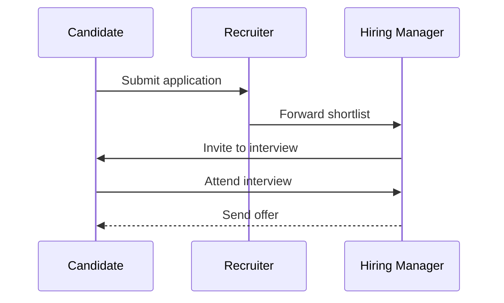

# **Diagrams**

Hand-drawn, modeled, or generated from text, all on-brand.

---
layout: excalidraw
title: Draw it, drop it in
eyebrow: 04 - Diagrams
accent: blue
diagram: resources/04-diagrams/compose-diagram.excalidraw.svg
alt: Client to gateway to service with two pods
---

<!--
  excalidraw archetype: frames one .excalidraw.svg in a branded white card, the
  sibling of the bpmn/dmn/mermaid archetypes. The diagram comes from the `src`
  frontmatter; the default slot holds the caption below.
  REQUIRED: diagram (the .excalidraw.svg in the chapter's resources/).
  OPTIONAL: title, eyebrow, accent, alt; a caption line in the body.
  Transition: "And you edit it without leaving your editor."
-->

A diagram is one **.excalidraw.svg** with the scene embedded, in the Miragon palette.

---
layout: excalidraw
title: Or set it beside your points
eyebrow: 04 - Diagrams
accent: blue
diagram: resources/04-diagrams/service.excalidraw.svg
alt: A service routing to two pods
side: right
ratio: "1/1"
height: 20rem
---

<!--
  excalidraw SPLIT mode: `side` frames the diagram on one side (here right) and
  turns the default slot into the content column opposite, styled like a content
  slide (branded bullets, StepList, Card ...). Omit `side` for the full-width
  diagram with a caption below (slide before this one). dmn and mermaid take the
  same side/ratio/height props; mermaid feeds its column from the ::caption:: slot.
  REQUIRED: diagram.  OPTIONAL: side, ratio, height, title, eyebrow, accent, alt.
  LIMIT: keep the column to ~4 bullets so it clears the bottom-left page chrome.
  Transition: "Need to edit it? Open it in your IDE."
-->

- The diagram is framed on **one side**, your points on the other
- Same white card as full mode, now next to the text
- **Bullets** render exactly like a content slide
- Vary `side` so the diagram is not always on the left

---
layout: content
title: Edit it right in your IDE
eyebrow: 04 - Diagrams
accent: blue
---

<!--
  KEY POINT: .excalidraw.svg files open and edit in the IDE via the Excalidraw plugin.
  SplitView: diagram left, explanation right. The <DiagramFrame> gives the diagram
  the same white card as the diagram layouts, for framing PART of a slide where a
  text Card is not the right fit. Transition: "Need a process? Use BPMN."
-->

<SplitView ratio="1/1">
<template #visual>
<DiagramFrame height="19rem">
<Figure src="resources/04-diagrams/service.excalidraw.svg" alt="A service routing to two pods" max-height="220px"></Figure>
</DiagramFrame>
</template>

- Install the **Excalidraw plugin** for **VS Code** or **IntelliJ**
- Open the `.excalidraw.svg`, edit it visually, save; the slide reloads
- The scene stays embedded, so the file is both image and source
- No photoshop, no separate tool, no export dance

</SplitView>

---
layout: content
title: Always on-brand, always transparent
eyebrow: 04 - Diagrams
accent: blue
---

<!--
  How diagrams stay consistent + the excalidraw skill. Transition: "Or a real process: BPMN."
-->

<v-clicks>

- Colours come from the Miragon palette, the same tokens the theme uses
- Exports are light and transparent, so they sit on any slide
- The headless verify suite rejects a dark or opaque diagram
- Or describe it in words and let the **`excalidraw` skill** draw it for you

</v-clicks>

---
layout: subsection
index: "4.1"
eyebrow: 04 - Diagrams
accent: blue
---

<!--
  subsection: divides a chapter INTERNALLY without opening a new chapter in the
  Agenda rail (which counts only `layout: section`). Here it splits the chapter:
  hand-drawn Excalidraw above, the modeled/standard diagram types below.
  Visually subordinate to `section`: smaller title, fainter ghost numeral.
  REQUIRED: none.  OPTIONAL: index (ghost numeral), eyebrow, accent, h1 + <p>.
  The Agenda can preview these dividers instead of every slide via
  `<Agenda preview="subsections">`.
  Transition: "Start with a real process: BPMN."
-->

# Or a **modeled** diagram

Standard notations: BPMN, DMN, and Mermaid, each on-brand.

---
layout: bpmn
title: Or a real BPMN process
eyebrow: 04 - Diagrams
accent: blue
diagram: /resources/04-diagrams/recruitment.bpmn
height: 330px
mode: modeler
transactionBoundaries: true
engine: camunda7
---

<!--
  bpmn archetype: renders a .bpmn file via slidev-addon-bpmn.
  File lives in this chapter's resources/.
-->

A real BPMN file, straight from Camunda Modeler or bpmn.io.

---
layout: bpmn
title: Put the process beside its rules
eyebrow: 04 - Diagrams
accent: blue
diagram: /resources/04-diagrams/recruitment.bpmn
mode: token
side: left
ratio: "1.2/1"
height: 320px
---

<!--
  bpmn SPLIT mode: `side: left|right` frames the diagram on that side and turns
  the default slot into the content column opposite (here: process left, talking
  points right). Omit `side` for the full-width diagram + caption (slide before).
  All bpmn modes (static/token/modeler) work in split; keep the modeler for
  full-width slides where it has room to breathe. dmn and mermaid split the same.
  REQUIRED: diagram.  OPTIONAL: side, ratio, height, mode, engine, title, eyebrow, accent.
  LIMIT: ~4 bullets / a short StepList so the column does not crowd the diagram.
  Transition: "The decisions inside it split the same way."
-->

- Read the **model** and the **narrative** in one glance
- No `content` + `SplitView` scaffolding, just `side`
- The framed white card sits only on the diagram side
- The column is styled like a normal content slide

---
layout: dmn
title: And the decisions inside it
eyebrow: 04 - Diagrams
accent: blue
diagram: /resources/04-diagrams/hiring.dmn
height: 230px
mode: simulate
fontSize: 10px
fullscreenFontSize: 12px
---

<!--
  dmn archetype: renders a .dmn decision (slidev-addon-dmn), the sibling of the
  bpmn archetype. BPMN models the process, DMN models the decisions inside it.
  The mode prop mirrors bpmn: "table" (default) / "simulate" / "drd" / "modeler".
  "simulate" is DMN's answer to the bpmn token flow: pick inputs, hit Simulate,
  watch the firing rule light up. The Fullscreen button next to the form blows the
  table up to the full viewport (fullscreenFontSize sizes it for the back of the
  room). File lives in this chapter's resources/.
  Transition: "Slidev can also draw from text: Mermaid."
-->

A DMN decision, live: feed the inputs in and watch which rule fires.

---
layout: mermaid
title: Or generate one from text with Mermaid
eyebrow: 04 - Diagrams
accent: blue
---

<!--
  mermaid archetype: frames a native ```mermaid diagram in a branded white card,
  the sibling of the bpmn/dmn archetypes. The diagram is brand-styled globally by
  the theme's setup/mermaid.ts (Miragon palette, Geist, rounded boxes). Like an
  Excalidraw asset, the source can live in its own .mermaid file, imported here
  with the <<< snippet syntax.
  REQUIRED: the ```mermaid fence (or a <<< import) in the body -> the white card.
  OPTIONAL: title, eyebrow, accent; a ::caption:: named slot for the line below.
  Transition: "Or write it inline, right on the slide."
-->

<<< @/chapter/04-diagrams/resources/recruitment-flow.mermaid

::caption::

Generated from **text** in a `.mermaid` file, framed on-brand by the layout.

---
layout: content
title: Or write it inline on the slide
eyebrow: 04 - Diagrams
accent: blue
---

<!--
  Same Mermaid, defined inline in the slide instead of a file: a sequence diagram
  of the same hiring flow. Use a file for reuse, inline for a one-off.
  Transition: "Now: how do you write all this?"
-->

Or write the source inline on the slide, here as a sequence diagram.


